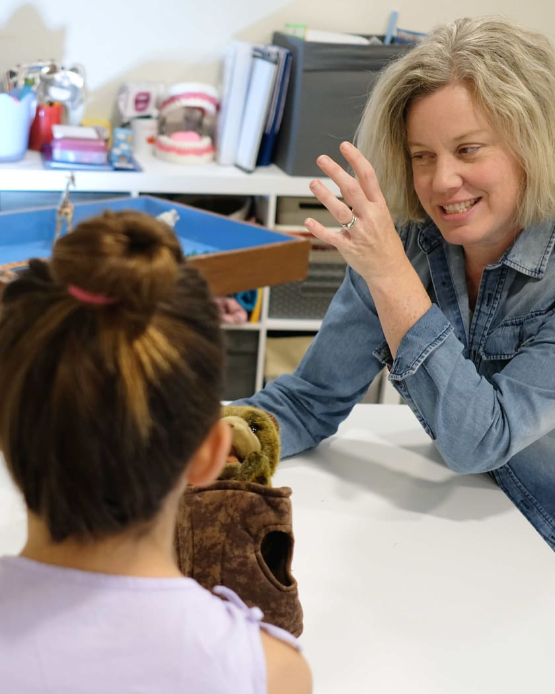

# Photography

**Every image on the site is currently a striped placeholder. The site must not
launch with them, and stock imagery is not a substitute.**

## Direction

Candid and warm, real rooms and real light. Never stock-lit families on white.

Children's faces need explicit consent handling, so plan on **hands, materials,
room details and backs of heads** as the working fallback — assume no child's
face is usable and treat any that is as a bonus.

Kristina's own face is used generously. One primary portrait appears everywhere,
including Jane and the directory listings, so that a parent who finds her on
BCACC, BCPTA or Psychology Today sees the same person.

## Shot list

| # | Shot | Ratio | Used on |
|---|---|---|---|
| 1 | Kristina in the play space, candid, child mid-play | 4:5 | `index.html` hero |
| 2 | Kristina, primary portrait | 4:5 | `about.html` hero, `index.html` sky block, Jane, BCACC, BCPTA, Psychology Today, Google Business Profile |
| 3 | The play space, wide — sand tray, art materials, floor space | 16:9 | `about.html`, "Where we'd meet" |
| 4 | Sand tray with a child's hands | 4:5 | Not yet placed; hold for the play-therapy page or directories |
| 5 | Two parents mid-conversation, candid | 3:2 | `for-parents.html`, "Reading first is fine too" |
| 6 | Intro video, 60–90 seconds, Kristina explaining why she works this way | 16:9 | Not yet placed. Needs captions **and** a transcript |

Also needed, though not a photograph: a 1200×630 crop of shot 2 for
`og:image` / `twitter:image` on every page.

## Resolution and export

These numbers are measured, not estimated: every slot was rendered across 23
viewport widths from 320px to 2560px and the largest box each one ever occupies
was recorded.

One result is counter-intuitive and worth knowing before you export anything.
**The photographs are at their largest at a 900px viewport, not on a desktop.**
900px is the widest the layout is still a single column, so the image spans the
full content width there; above 900px it drops into a side-by-side column and
gets *narrower*. Sizing for a 27-inch monitor would over-deliver on desktop and
still under-deliver on a tablet.

| Slot | Largest CSS box | Export at 1× | Export at 2× |
|---|---|---|---|
| Home hero, 4:5 | 821 × 1026 | 840 × 1050 | **1700 × 2125** |
| About portrait, 4:5 | 821 × 1026 | 840 × 1050 | **1700 × 2125** |
| Home "Hi, I'm Kristina", 4:5 | 420 × 525 | 440 × 550 | **900 × 1125** |
| Play space, 16:9 | 821 × 462 | 840 × 473 | **1700 × 956** |
| Two parents, 3:2 | 821 × 547 | 840 × 560 | **1700 × 1133** |

Two exports per shot, at 1× and 2×, wired through `srcset`. There is no 3×
export: the only devices with that pixel density are phones, and a phone is
never wider than about 430 CSS px, so its 3× demand (about 1170px) is already
covered by the 2× file.

Also needed:

| Asset | Size | Notes |
|---|---|---|
| `og:image` | 1200 × 630 | Crop of the primary portrait. One per page, or one shared. |
| Directory portrait | 1000 × 1000 | Square crop for Jane, BCACC, BCPTA, Psychology Today, Google Business Profile. Same portrait everywhere — that consistency is the point. |
| Intro video | 1920 × 1080 | MP4 (H.264) plus WebM. Captions and a transcript are required. |
| Video poster | 1700 × 956 | A still from the video, same treatment as the photographs. |

### Masters

Keep the full-resolution originals, **minimum 3000px on the long edge**, and
retain the RAW files. The feeling shapes and this photography are both meant to
carry over to print — wall vinyl for the play room, stickers, the cover of an
intake pack, a future sign — and none of that can be cut from a 1700px web
export.

### File formats and budget

AVIF and WebP with a JPEG fallback, sRGB, embedded colour profile. Rough
targets, per image:

| Format | 2× export | 1× export |
|---|---|---|
| AVIF | ≤ 90 KB | ≤ 30 KB |
| WebP | ≤ 160 KB | ≤ 55 KB |
| JPEG | quality ~78 | quality ~78 |

The home hero is preloaded and is the LCP element on the page most people land
on, so keep that one leanest of all. Most enquiries arrive from a phone late at
night, often on a rural connection.

### Strip the metadata

**Remove EXIF from every file before it ships, GPS coordinates especially.**
The office address is deliberately not published — `contact.html` says it is
sent with the first booking — and a geotagged photograph of the play room
publishes it anyway. This applies to the room and sand-tray shots in
particular. Most export presets have a "strip metadata" option; use it, then
spot-check one file with `exiftool`.

## Swapping a placeholder in

Each slot looks like this:

```html
<!-- PLACEHOLDER — replace with the real photograph and real alt text. -->
<div class="photo photo--4x5">
  <svg class="photo__stripes" aria-hidden="true" focusable="false">…</svg>
  <span class="photo__caption">PHOTO — candid, child mid-play in the room, 4:5</span>
</div>
```

Replace the whole inner content with a `<picture>`, keeping the wrapper and its
ratio class:

```html
<div class="photo photo--4x5">
  <picture>
    <source type="image/avif"
            srcset="assets/img/hero-840.avif 840w, assets/img/hero-1700.avif 1700w"
            sizes="(min-width: 901px) 45vw, 92vw">
    <source type="image/webp"
            srcset="assets/img/hero-840.webp 840w, assets/img/hero-1700.webp 1700w"
            sizes="(min-width: 901px) 45vw, 92vw">
    
  </picture>
</div>
```

The `sizes` value rounds up slightly rather than trying to model the grid
exactly — over-fetching a little is cheaper than a soft image. For the narrower
"Hi, I'm Kristina" slot use `sizes="(min-width: 901px) 420px, 92vw"` with the
900w and 440w exports.

Notes:

- `.photo > img` is already `width:100%; height:100%; object-fit:cover`, so the
  wrapper's ratio class governs the crop.
- **The hero image on each page is the exception:** drop `loading="lazy"` and add
  `<link rel="preload" as="image" href="…">` to that page's `<head>`. It is the
  LCP element, and most enquiries arrive from a phone late at night.
- Always set `width` and `height` on the `` so nothing shifts as it loads.
- AVIF and WebP with a JPG fallback.

## Alt text

Real alt text on every photograph, never a filename and never "photo of
Kristina". Describe what a person who cannot see it would need: what is in the
frame and what it conveys. Decorative crayon shapes are `aria-hidden="true"` and
take no alt text — that is already handled.

## When the last placeholder is gone

Delete the placeholder scaffolding, which will then be dead code:

- the `<svg width="0" height="0">` stripe-pattern block near the top of
  `index.html`, `about.html` and `for-parents.html`,
- the `.photo__stripes` and `.photo__caption` rules in `assets/css/site.css`.
